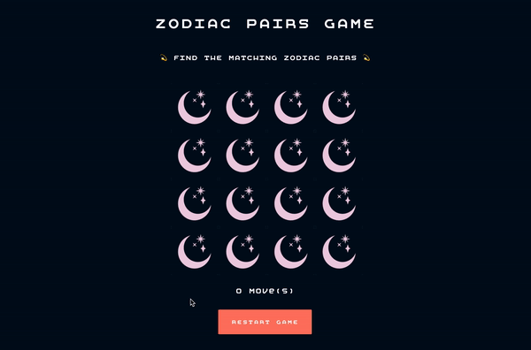

# Memory Game

> _Tasked with building a functioning browser based game, I decided to recreate the matching pairs / memory game. It features a selection of Zodiac signs, laid out in a 4x4 grid for the player to try and locate all of the matching pairs in the smallest number of moves possible._ </br>

#### Project Link [_here_](https://amiehannah.github.io/memory-game/).

##

<p align="center">
  
</p>

## User Story:

- As a player of this game, I want to be able to find all of the matching Zodiac signs, so that I am able to complete the game, in the least number of moves possible.

- Given that the game is about to start, the game board should begin with all card values hidden (all Zodiac signs should be hidden away from the player).
- Given that the game has begun and the player selects a card on the gameboard, then the card display should change, simulating a flip effect to reveal the hidden Zodiac sign underneath.
- Given that the player has made the first move on the board, the "moves" counter should begin and will continue to increment by one on each move that the player makes until either scenario - all matching pairs have been found or the game is restarted.
- Given that only once card is selected, then the cards can't be compared for a match. The player needs to select two cards consecutively in order to check for a match.
- Given that the player has selected two cards at random and the Zodiac signs successfully match, the cards remain face up and the player can then continue to search for matching pairs.
- Given that the player has selected two cards at random and the Zodiac signs do not match, the cards flip back over and the check for match process starts again.
- Given that the game is in progress, when the player clicks on the restart game button, the gameboard should reset. The cards should be flipped over once again, hiding the values underneath, the sequence of cards on the board should be randomised and the moves counter should return to 0, to allow the user to start the game afresh.
- Given that the player has found all of the matching Zodiac pairs on the board, alert the player that all matches have been found and how many moves it has taken to complete the game.

## Functionality:

1. Started by storing the data in a function that returns an array of objects, with their relevant names and image paths. All png images I will be using for the cards are saved in an image folder, where their relevant paths match those in the array of objects.

```javascript
const getCardArray = () => [
  { name: "aries", imgSrc: "./images/aries.png" },
  { name: "cancer", imgSrc: "./images/cancer.png" },
  { name: "taurus", imgSrc: "./images/taurus.png" },
];
```

2. The first function, `randomiseCards()` - ensures that the cardData array is sorted randomly using `array.sort()` and `Math.random()` built in JS methods.
   <br> This ensures that each time the game is played the cards aren't in the same position on the board.

3. `createCards()` calls the randomiseCards function, returning an array of objects.
   I've looped over these objects using a `forEach()` and dynamically created the image elements with their relevant src properties, appending them to the board. I've applied classes to each element to allow me to add styles to them.
   </br> I've also added an event listener to listen out for each click event on the card. Inside this event listener I toggle styles on the card (to simulate a flip) and run the checkForMatch function, passing in the click event `checkForMatch(e)`.

4. In `checkForMatch()` I find the element that was clicked using `e.target` and apply a class of **_'flipped'_** to it. Note this class is not used for styling - purely functional. The cards with a class of **_'flipped'_** are saved in the variable **_'flippedCards'_**. Once `flippedCards.length === 2` (i.e. 2 cards have been flipped), check to see if the names attributes match.
   </br> If a match is found, I remove the class of **_'flipped'_**, add a class of **_'matched'_** and prevent further clicks on the card by setting the pointerEvent to 'none'.
   </br> I've then created a variable called **_'matchedCards'_** which selects all elements with a class of **_'matched'_**. Once `matchedCards.length === 16` (i.e. all elements on the board have been found) create an alert popup.
   </br>If no match is found, I remove the **_'flipped'_** class on the card and after a delay I remove the **_'toggleCard'_** class ready to check the next two cards that are selected.
   After each go (whether matched or not) the `scoreCount` incremements by 1 and the display is updated.
   This `checkforMatch()` function will run on every click event until all matches have been found.

5. `restartGame()` - on the click event, this function randomises the cards ready for a new game. It selects all the cardFace elements with a class of 'face' and also selects all 'card' elements with a class of card.
   </br>Using another forEach, I remove all of the classes applied to the cards, enable the user to once again click on the elements and apply the images and set name attributes to each card.
   </br>I also reset the score count and update the display, ready to play the game again.

## Inbuilt JS Methods:

The following inbuilt JavaScript methods are used in this codebase:

- `document.querySelector()`
- `document.createElement()`
- `document.appendChild()`
- `Math.random()`
- `array.sort()`
- `array.forEach()`
- `array.length()`
- `element.addEventListener()`
- `element.setAttribute()`
- `element.getAttribute()`
- `element.classList.add(), remove() & toggle()`

## Technologies & Features:

- JavaScript
- HTML5
- CSS
- Mobile first / responsive design
- Git Version Control
- UI - created a selection of zodiac signs to use on each card using Adobe Illustrator.

## Further Developments:

- Add in a timer to the game, so alongside the move counter, the user is able to see how fast they can find all of the matching pairs.

## Contact

Created by [Amie Edwards](mailto:amie.edwards17@gmail.com)

<br/>
<div align="right">
    <b><a href="#memory-game"> ^ back to top</a></b>
</div>
<br/>
